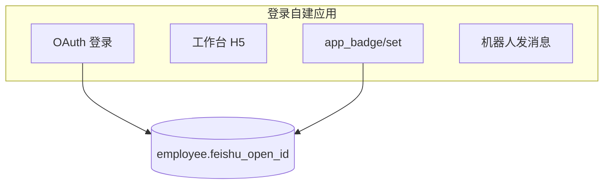

# 飞书应用角标（工作台红点）配置指南

本文说明如何在「登录应用兼网页应用 + 多主体」架构下，为 **绩效** 配置工作台角标（红点/数字），并与站内待办 `GET /api/home/todos` 数量保持一致。

---

## 1. 功能说明

- **应用角标**：飞书工作台「绩效」图标右上角的红色数字（1–999）或红点（>999），用于提醒待办。
- **与 IM 未读无关**：任务助手里的消息、飞书 Task 待办 **不会** 自动变成工作台应用角标。
- **与站内待办一致**：角标数字 = 当前用户当月 `GET /api/home/todos` 返回的 `items` 条数（含本人流程待办；有权限时含全部「待校准」记录）。
- **开关**：数据库 `system_config.feishu_app_badge_enabled`（`1` 开启，`0` 关闭）；已有库可执行 `server-java/database/sql/sync-feishu-app-badge-enabled.sql`。

---

## 2. 应用架构（必读）

同一飞书自建应用同时开启 **网页应用**、**机器人**（可选 **IM 应用** 拆行）时：

| 能力 | `feishu_app` 标记 | 职责 |
|------|-------------------|------|
| **登录 + 网页** | `is_login_app = 1` | OAuth、`feishu_open_id`、工作台 H5、`app_badge/set`、JSSDK |
| **IM / 机器人**（可选另应用） | `is_im_app = 1` | 私聊卡片、飞书 Task |

角标与 JSSDK 使用登录行的 `app_id` / `app_secret`（`findDirectoryAppForSubjectId`），`user_id` 为 `employee_hierarchy.feishu_open_id`。

发版时在开放平台将 **桌面端/移动端默认能力** 设为 **网页应用**，员工从工作台进入 H5 而非机器人会话。



---

## 3. 飞书开放平台操作步骤

1. 登录 [飞书开放平台](https://open.feishu.cn/app) → 选择 **绩效** 自建应用。
2. **应用能力** → **网页应用**：配置桌面端/移动端主页（如 `https://你的域名/feishu/login/kzs`）、重定向 URL、H5 可信域名。
3. **版本管理与发布** → 创建版本时 **默认能力选网页应用**（桌面端 + 移动端）→ 发布。
4. 开通角标、JSSDK 相关权限后再次发布。
5. 用户将应用加入工作台 **我的常用**；客户端建议 ≥ 3.42。

---

## 4. 数据库配置

### 4.1 主体与应用

```sql
SELECT s.code, a.app_id, a.is_login_app, a.is_im_app
FROM feishu_app a
JOIN feishu_subject s ON s.id = a.feishu_subject_id
WHERE a.is_login_app = 1;
```

- `feishu_subject.code`：与 URL `/feishu/login/{code}` 一致。
- 登录行填写 OAuth 的 `app_id`、`app_secret`、`redirect_uri`。

**已有库**若曾加过独立网页应用字段，执行：

```bash
mysql ... < server-java/database/sql/drop-feishu-web-app-columns.sql
```

### 4.2 员工 open_id

```sql
SELECT employee_id, feishu_open_id FROM employee_hierarchy WHERE employee_id = '某员工ID';
```

角标仅使用 `feishu_open_id`（飞书 OAuth 登录写入）。

### 4.3 角标总开关

见 `sync-feishu-app-badge-enabled.sql` 或 `initial.sql` 中 `feishu_app_badge_enabled`。

---

## 5. 服务端行为

| 机制 | 说明 |
|------|------|
| `FeishuAppBadgeService` | `POST /open-apis/application/v6/app_badge/set` |
| `FeishuBadgeSyncService` | 按 `feishu_open_id` 与待办数同步 |
| `POST /api/feishu/app-badge/sync` | 当前用户手动同步 |
| `GET /api/feishu/jssdk-config?url=` | H5 JSSDK 鉴权 |

角标在绩效变更后异步同步，进入 H5 时前端也会触发同步；无全量定时任务。

---

## 6. 验证与排错

1. 确认 `feishu_open_id`、`feishu_app_badge_enabled=1`。
2. `POST /api/feishu/app-badge/sync`（Cookie 登录）。
3. 工作台「绩效」图标显示数字；日志搜 `飞书应用角标`。

| 现象 | 处理 |
|------|------|
| 点开是机器人 | 发版默认能力改为网页应用 |
| cross app | 确认未再用旧独立网页 App 的 open_id |
| 无角标 | 加入「我的常用」、检查 open_id 与开关 |

---

## 7. 相关文档

- [应用角标开发指南](https://open.feishu.cn/document/uAjLw4CM/ukzMukzMukzM/application-badge/development-guide-for-using-the-application-badge)
- [app_badge/set API](https://open.feishu.cn/document/server-docs/application-v6/app_badge/set)
